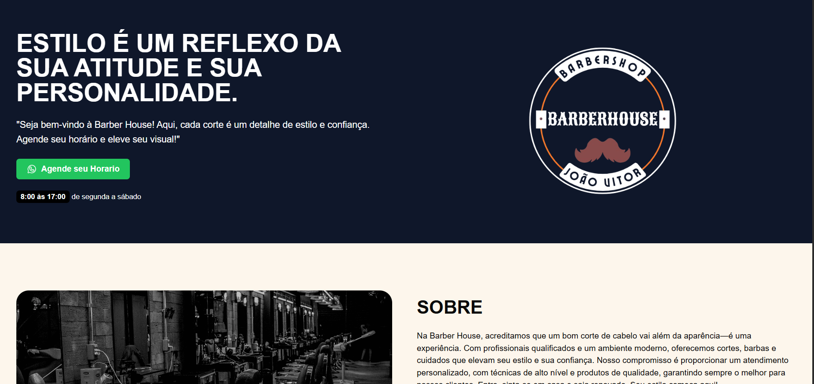

<p align="center">
  
</p>

<h1 align="center">💈 BarberHouse</h1>

<p align="center">
  Um projeto fictício de barbearia desenvolvido com <strong>Next.js</strong>, <strong>TypeScript</strong> e <strong>Tailwind CSS</strong>.  
  Criado para demonstrar habilidades em front-end, design responsivo e boas práticas de desenvolvimento moderno.
</p>

<p align="center">
  
  
  
  
  
</p>

---

## 🌐 Demo

👉 [barber-house-three.vercel.app](https://barber-house-three.vercel.app/)

## 🧠 Tech Stack

[](https://skillicons.dev)

---

## ⚙️ Getting Started

1. **Clone o projeto**
   ```bash
   git clone https://github.com/jotavitorz/barber-house.git
    ````

2. **Entre na pasta**
   ```bash
   cd barber-house
    ````

3. **Instale as dependências**

   ```bash
   npm install
   # ou
   yarn
   ```

4. **Inicie o servidor de desenvolvimento**

   ```bash
   npm run dev
   # ou
   yarn dev
   ```

5. O projeto estará disponível em [http://localhost:3000](http://localhost:3000)

---

## ✨ Funcionalidades

* 🧔 **Hero Section** – Apresentação principal com chamada visual.
* 🧾 **Sobre** – Breve descrição sobre a barbearia (conteúdo fictício).
* 💈 **Serviços e Planos** – Listagem ilustrativa de opções e preços.
* 💬 **Depoimentos** – Comentários e feedbacks de exemplo.
* 📞 **Footer** – Contato e redes sociais simuladas.
* ⚡ **Responsivo** – Totalmente adaptado para desktop e mobile.

---

## 💡 Objetivo do Projeto

Este projeto foi criado com fins **educacionais e de portfólio**, representando o site de uma barbearia moderna.
O foco está na **organização do código**, **design limpo** e **uso eficiente das tecnologias Next.js + Tailwind + TypeScript**.

---

## 🤝 Contribuindo

1. **Clone o repositório**

   ```bash
   git clone https://github.com/seu-usuario/barberhouse.git
   ```
2. **Crie uma nova branch**

   ```bash
   git checkout -b feature/nome-da-feature
   ```
3. **Envie seu commit**

   ```bash
   git commit -m "feat: descrição da mudança"
   ```
4. **Abra um Pull Request**

---

## 🪪 License

Este projeto está sob a licença [MIT](https://opensource.org/licenses/MIT).
Sinta-se livre para usar como referência ou inspiração.

---

<p align="center">💈 Desenvolvido com <strong> < / > </strong> por <strong>João Vitor</strong></p>
